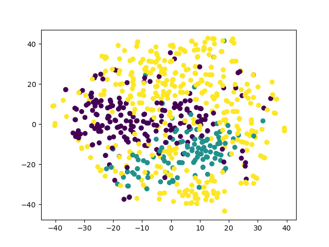
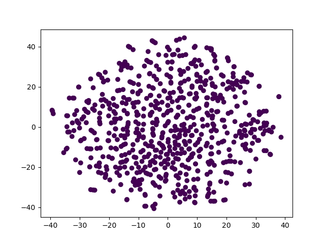
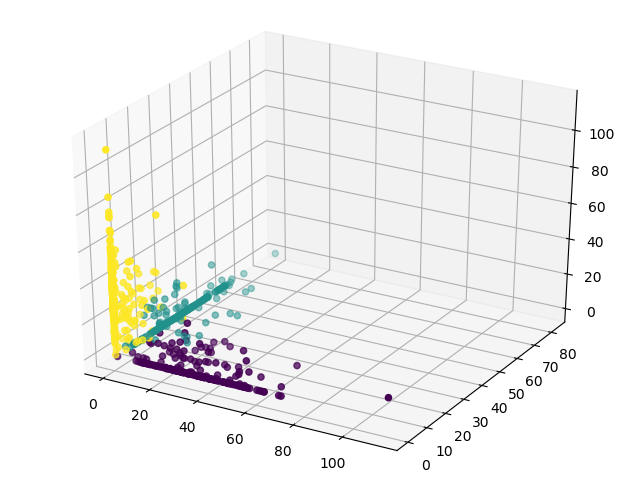

# Java 大作业报告

#### 计83 张哲昕 2018012131      计84 温佳鑫  2017010335

## 代码结构

## 分工

1. 温佳鑫主要负责View与Presenter的实现

   > 并实现了 kmeans, dbscan的聚类算法及可视化

2.  张哲昕主要负责Model的实现

   > 并使用`MPAndroidChart`绘制了疫情数据柱形图;
   >
   > 使用`QMUIGroupListView`绘制了知识图谱详情页与知识学者详情页中需要的[属性,关系] 

## 具体实现 亮点与难点

### 温佳鑫

#### 1. 解耦前后端开发：MVP架构

在大作业开始的初期，我们希望找到一种良好的解耦方式为后续开发奠定基础。老师在课上曾介绍过MVC架构，进一步查询了解后，我们选定了MVP架构。简单的说，View层只通过Presenter与Model进行交互。

这使得我们能够同步开发测试，不会被“阻塞”。事实上，我后续在进行重构、复用时，得益于这一框架的选取，减少了很多麻烦。

#### 2. 架构设计：重构与复用

​    这次大作业要显示的页面（除了疫情数据外）可以大致分为两种，即列表页与详情页，它们一一对应：【新闻列表页，新闻详情页】；【知识图谱列表页，知识图谱详情页】；【知疫学者列表页，知疫学者详情页】。

​	列表页具有明显的可复用性。显示不同类型的数据时，实际上只需要根据这一类型所具有的成员，做少量的更改。

​	 最初我创建了`NewsListFragment`，用于显示新闻列表。在开发其他列表页的显示之前。我对这部分代码进行重构，抽象出`MyListFragment, MyListPresenter, MyListView，ListAdapter`泛型类。在此基础上，每种需要以列表形式显示的数据，仅需要写极少量的代码即可完成开发。

#### 3. 使软件更流畅：控制与利用activity和fragment的生命周期

   	流畅性一度给我带来了很大的困扰。最初activity之间，fragment之间的切换都存在卡顿的现象，我在activity

的`onCreate`, fragment的`onCreateView`函数中输出，发现他们在切换过程中又重新构建了。

#### 3.0 目标效果

(1) 列表页面切换到详情页面，再切换回列表页面时，数据不变。 ->  保存activity的数据

(2) 分类A页面切换到分类B页面，再切换回分类A页面时，数据不变。 -> 保存fragment的数据

​	//浏览历史页面除外，每次显示浏览历史页面时，都应显示最新的数据。

(3) **切换流畅！**

#### 3.1 acvitity的切换

​		为了解决的activity在切换时需要重新构建的问题，我通过阅读文档发现：intent可以通过flag，指定切换activity的细节，并最终选定了`Intent.FLAG_ACTIVITY_REORDER_TO_FRONT`。它的语义是如果被启动的activity已经有实例在任务栈中，就不重新创建，而是恢复原来的实例，并提到栈顶。

#### 3.2 fragment的加载与切换&&FragmentPagerAdapter的正确使用

​		首先我要解决的是fragment切换需要重新创建的问题。最初我采用的是replace, 但这必然导致fragment的重复创建。为了避免这一情况，我选择在Activity的onCreate中创建依附于这一acitivty的所有fragment，通过`hide`,`show`达到fragment切换的效果。

​	 	其次我对fragment做了懒加载，即将最为耗时的数据获取指令移动到`onResume`函数中，这使得activity显示时，只需要获取当前显示的fragment所需要的数据。

​		在探索懒加载做法的过程中，我在继承FragmentPagerAdapter时发现了一个新的构造函数。`public FragmentPagerAdapter(@NonNull FragmentManager fm,@Behavior int behavior)`。在源代码中我了解到`setMaxLifeCycle`这一控制生命周期的方法。具体来说，我将未显示fragment的状态设置为`State.STARTED`, 显示时设为`State.RESUMED`, 切换时再次回到`State.STARTED`。这使得fragment的生命周期被控制在onStarted->onResume->onPause->onResume...这个切换流程中。

​		但事情并不这样简单，我发现当我从第一个tab切换到第三个tab时，第一个tab对应的fragment进入了`onDetroyView`。我认为这是FragmentPagerAdapter执行的操作，并再次进入源码确认了这一判断：adapter内部会destroy fragment。原本我在fragment的`onDetroyView`函数中将一个bool值置为true，用于标记`onResume`时要重新获取数据。为了避免这一问题，我用类成员保存了`onCreateView`中inflate得到的view，只有inflate前view为null时，才在`onResume`中重新获取数据。

#### 4. 搜索的实现

​	搜索框开始进展的很顺利，我在官方文档中找到了`SearchRecentSuggestionsProvider`，简洁地实现了搜索历史的记录。但我发现它是通过发送intent启动activity实现的。原本我将MainActivity作为接收intent的类，这导致MainActivity的重新创建。事实上，即使我实现一个SearchActivity, 这个activity也会随着每一次搜索重新创建。我希望的操作是每搜索一次就更新一下fragment的内容。

​	最初我的想法是在搜索框submit的监听器里取出数据，return true，阻断intent的发送。但这使点击历史记录直接搜索的功能失效了。

​	后来我想到可以在intent发送时拦截，经过检索，我在`startActivityForResult`中拦截了这一intent的发送。简洁的实现了搜索。

#### 5. 聚类（Kmeans / dbscan)

​	我首先尝试了两种聚类算法，即kmeans与dbscan，并进行了一定的调参。通过观察算法的结果，聚类的数据，以及通过tsne降维得到的可视化结果等判定效果，如下图所示。

​	kmeans的可视化结果：

​    dbscan的可视化结果：

### 张哲昕

#### 6. 新闻本地存储

由于需要对用户浏览过的新闻进行存储，以便用户之后能够离线访问。相比于直接利用文件进行读写操作，使用数据库更为快捷，对处理结构化数据也更为方便。

课上提到过ORM的概念，即对象/关系数据库映射，通过ORM，我们可以直接利用面向对象的语言来进行编程，而不需要直接对数据库进行操作，这样更加方便，也减少了出错的可能。

课上推荐过使用SugarORM，但经过查询，该库已在几年前停止更新，经过比较，我最终选择了使用greenDAO作为我们使用的数据库工具，它具有速度快、轻量、功能强大等特点。除了对新闻的本地存储之外，由于对分类标签的增删也需要能够保存，因此我把分类的标签也存到了数据库当中。

#### 7. 上拉获取更多新闻

一开始我使用的是老接口，在程序一开始就把所有的新闻都读进来，但这样会消耗很长的时间，使得程序启动非常慢，而且在下拉刷新的时候也会消耗很多时间。

后来我使用了新接口，并在model中维护了page变量，每次上拉获取更多新闻时，只需要将page+1即可。这样使得一次从网络只获取少量的新闻，大大减少了时间与空间上的损耗。

#### 8. 新闻关键词搜索

由于接口当中并没有给出直接给关键词返回相关新闻的接口，因此如何能够在短时间内给用户返回比较好的结果成了一个很大的问题。

第一种想法是在用户搜索的时候，实时去下载新闻下来进行搜索，但是这样的问题，一是慢，二是可能得不到含有搜索关键词的新闻。如果用户等待了5s，但是却一个返回结果都没有，无疑会使得用户体验相当差。

因此，最终我选择了利用子线程提前并行下载新闻的办法。在程序启动时，开启一个子线程不断循环下载新闻（一次500条），并将结果保存到内存中，以便后续用户的搜索。这样做的好处一是快，因为开了子线程，既不影响主线程的功能，又能快速地获取新闻，在用户搜索时很快就能返回结果，而是返回结果得到了保证，因为新闻的基数大，基本能够保证返回给用户足够数量的结果。

#### 9. 疫情数据可视化

结合网络学堂的可视化工具推荐以及github的查找，我们最终选择了MPAndroidChart作为我们的可视化工具包。它的优势是功能强大，且容易使用。

由于需要对各国以及中国各省的疫情数据进行展示，所以我选择用两张图来展示，一张图展示各国的疫情数据，另一张图展示中国各省的疫情数据。为了更方便的比较各个地区的疫情数据，我选择使用柱状图的方式来对疫情数据进行展示。图的横轴是不同地区，而纵轴是各地区确诊的人数。如果点到柱子上，可以显示治愈人数、死亡人数等更详细的信息。

#### 10. 实体及知疫学者的详细信息显示

由于实体及知疫学者都需要对许多的key-value对进行展示，如何比较美观地展示这些数据，是一个问题。我想github上应该有一些现有的库，可以让我们便捷、美观地展示这些数据，而不用我们去重复造轮子。

经过一番查找，我最终选择了[QMUI_Android](https://github.com/Tencent/QMUI_Android)库来帮助展示这些数据。它的`QMUIGroupListView`作为一个ViewGroup，可以方便地插入许多不同格式的数据，我主要用的是将key显示在上方，将value显示在下方的格式（一个key-value对对应一个QMUICommonListItemView对象）。再结合ScrollView的使用，整体上来看还是比较美观的。另外，在使用这个库的过程当中，还发现了它的一个小bug，它在进行列表删除的时候使用了错误的方式，导致我的一个代码出现了奇怪的问题，我后来换了一种写法才避免了它的这个小bug。

#### 11. 通过LDA算法对新闻进行聚类

使用Kmeans之类的算法，一个问题是需要自己去找出每一类的关键词，这样可解释性就不足。为了增强算法的可解释性，我们最终使用了LDA算法来对新闻进行聚类。

LDA算法最重要的思想就是topic的概念，假设总共有n个topic，一个新闻属于某一个topic的概率为$p_i$，那么我们可以让该新闻属于对应概率最大的那个topic。那么确定了新闻所属的topic之后，如何确定这个topic的关键词呢？LDA算法已经帮我们做好了，它能够得到每一个topic与不同词的相关程度，我们只需要选择和该topic最相关的词作为该topic的关键词即可。从而就可以得到一篇新闻它对应的类别的关键词。

通过LDA算法，很好地增强了算法的可解释性，效果上也更好。

下面给出LDA算法可视化的结果（将新闻分为三类）：

可以看出新闻很好地被分为了三类。

## 总结与心得

温佳鑫：

我觉得android带给我的体验是要明显优于Qt的。一方面有很多十分实用的组件，另一方面也暴露了恰当的细节让程序员灵活操控组件，从而实现自己想要的效果。

回顾过去的一周，我们大作业推进的十分顺利，除了我们在初期做的一些决定（比如采用MVP架构）外，我们之间频繁有效的沟通起到了至关重要的作用。这是一次很成功的团队作业，感谢队友！

张哲昕：

android的生命周期相当重要，我们一开始对其不了解，导致fragment被销毁，activity重建等问题（从而导致页面卡顿），后来经过仔细的查找，才终于弄明白了卡顿的原因与生命周期有关，最终解决了这一问题。同时android的相关库也较为丰富，很好地替我们节省了精力。

总的来说，我们的进度在掌握之中，除了页面卡顿的bug给我们造成了较大困扰之外，其他地方都还顺利。队友十分的认真负责，在我们的共同努力下，终于算是完成了这次夹杂着汇编考试的大作业。感谢队友！也感谢助教的耐心解答！

## 附录

微信申请失败

